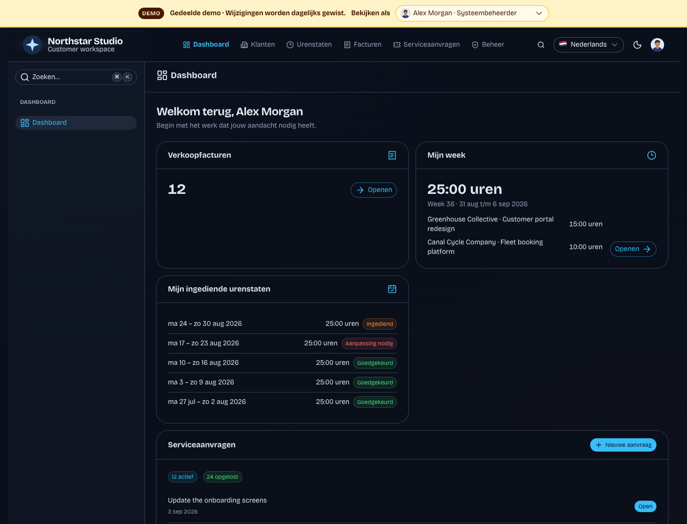
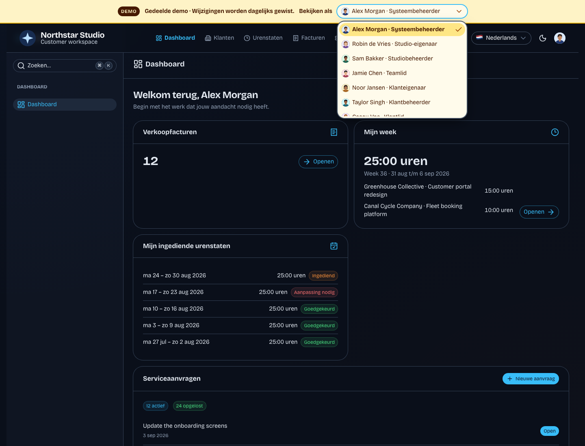
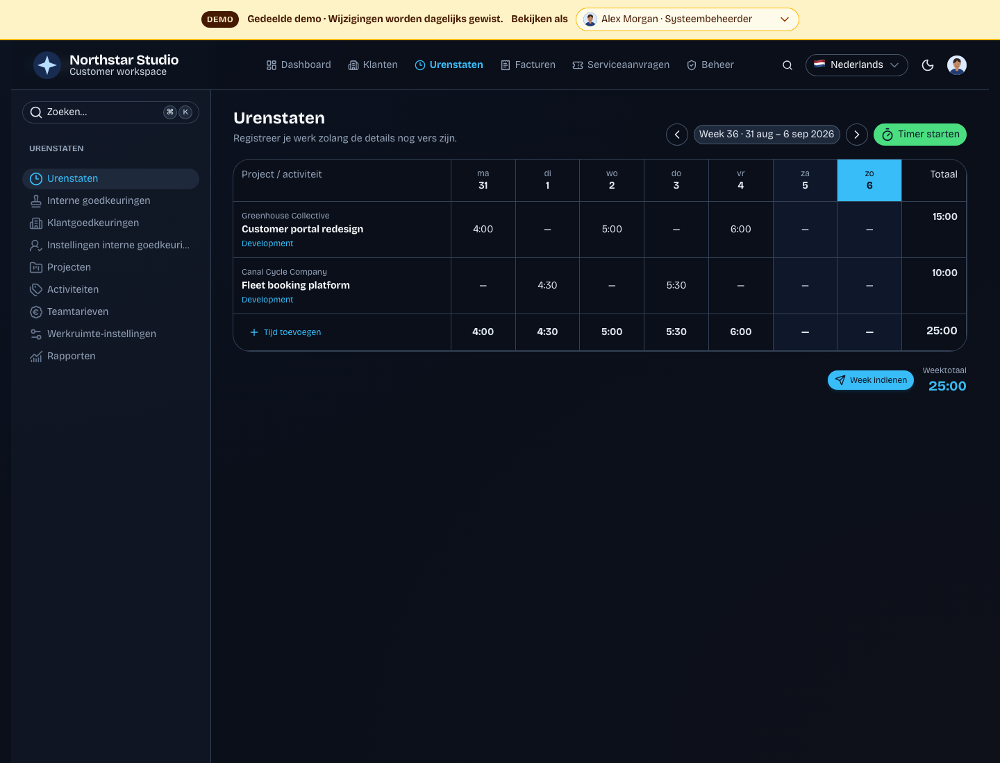
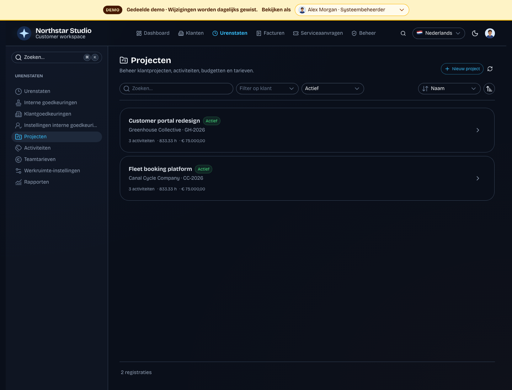
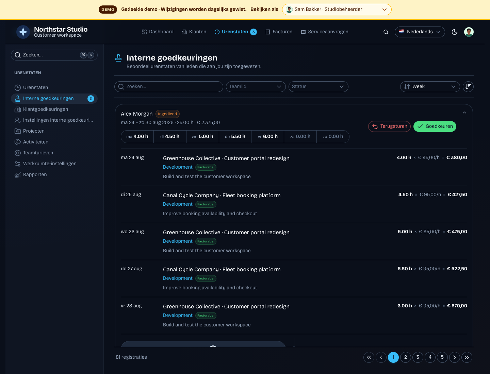
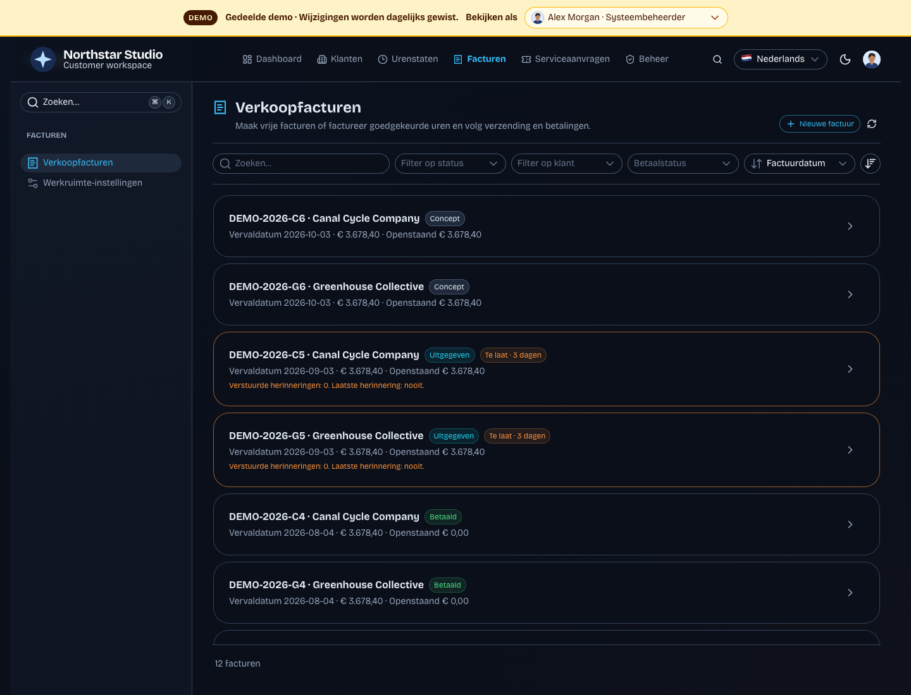
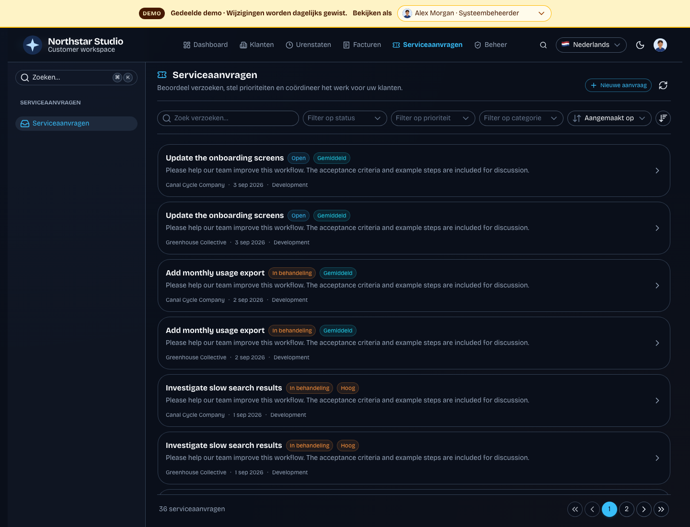
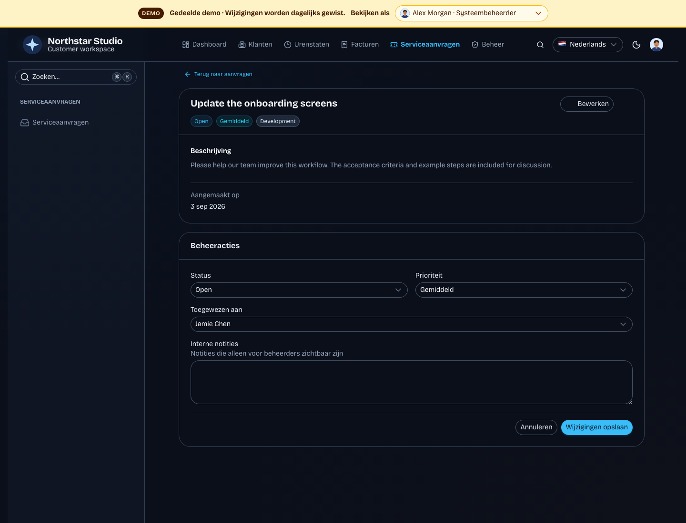
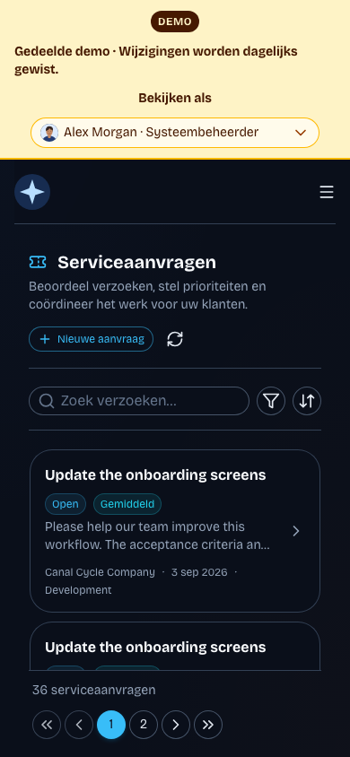

# Interactive demo — screenshot guide

Visual walkthrough for [PR #5](https://github.com/ludulicious/nuxt-customer-portal/pull/5), implementing [issue #4](https://github.com/ludulicious/nuxt-customer-portal/issues/4).

Captured from the running Northstar Studio demo on 6 September 2026, using Dutch translations and dark mode. All people, organizations, invoices, and work records shown are demo data. Desktop captures use a 1440 × 1100 viewport; the mobile capture uses 390 × 844. Development tools and the cookie notice are hidden for readability.

## Dashboard

Invoices and time tracking appear before service requests. The persistent top bar identifies the shared demo and its daily reset behavior.

## Demo user switcher

The open selector shows the seven fictional identities with their avatars and roles. Choosing another identity switches the visitor's session and reloads the dashboard with that user's permissions. The approval screenshot below shows the manager's view after switching to Sam Bakker.

## Weekly timesheet

Alex Morgan's seeded week contains recorded hours across two client projects, with daily totals and a weekly submission action.

## Timesheet projects

Project administration uses searchable, filterable cards with client names, activity counts, and budgets.

## Timesheet approvals

Sam Bakker's manager identity has assigned timesheets to review. This demonstrates a different permission-dependent view using the same shared dataset.

## Invoices

The seed includes invoices in several states and complete fictional sender details, so the setup warning is absent.

## Service requests

One workspace provides the shared collection toolbar, request cards, status and priority badges, client context, and numbered pagination. Creation is available from the header rather than a separate sidebar entry.

## Request management

Authorized users see status, priority, provider-team assignment, and internal notes on the request detail page. Customer accounts do not see these management controls.

## Mobile service requests

The toolbar collapses to search and filter/sort buttons. Pagination remains visible beneath the scrollable card list.

